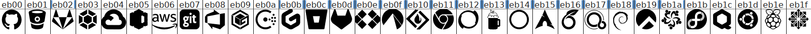
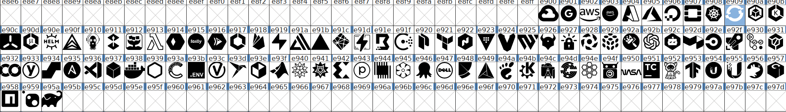

# Custom Patched Nerd Fonts

[](https://github.com/tprasadtp/starship-fonts/actions?query=workflow%3Abuild)
[](https://github.com/tprasadtp/nerd-fonts/releases/latest)
[](https://github.com/tprasadtp/nerd-fonts/blob/master/LICENSE)


Currently supports following custom [Nerd Fonts][].

  - [Cascadia Code][]
  - [Fantasque Sans Mono][]
  - Ubuntu

## Install

Download the fonts directly from [GitHub releases](https://github.com/tprasadtp/nerd-fonts/releases/latest) and install.

## Try

If you do not see symbols then you did not install the font properly.
Try re-opening your terminal if you just installed the font.

```bash
bash -c 'echo -e "\uE900 \uE901 \uE903 \uE904 \uE905 \uE906 \uE907 \uE908 \uE909 \uE90A \uE90B \uE90C"'
```

```bash
bash -c 'echo -e "\uEB00 \uEB01 \uEB03 \uEB04 \uEB05 \uEB06 \uEB07 \uEB08 \uEB09 \uEB0A \uEB0B \uEB0C"'
```

## Custom Glyphs

| Type | From | To
|---|---|---
| [Cloud Services](./docs/cloud-services.png) | E900 | E95A
| [Git Remotes](./docs/git-remotes.png) | EB00 | EB1F





## Build

```bash
make all
```


[Nerd Fonts]: https://github.com/ryanoasis/nerd-fonts
[Cascadia Code]: https://github.com/microsoft/cascadia-code
[Fantasque Sans Mono]: https://github.com/belluzj/fantasque-sans
